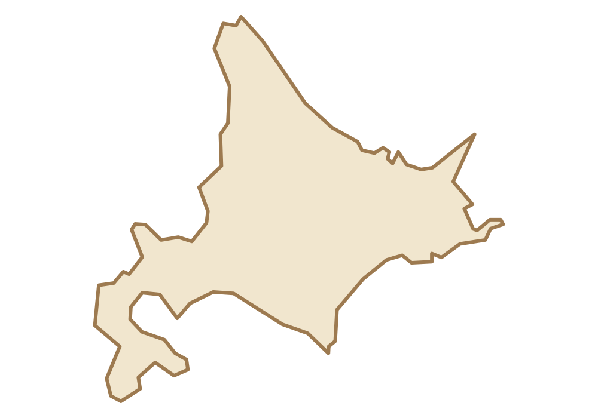

# Geo Explorer

日本発見！
地図をドラッグして学ぶ中学受験向けゲーム

---
https://ainotenoue.github.io/geo-explorer/

## Version History

v0.1
・ドラッグ操作完成

v0.2
・複数配置対応

v0.3
・山・川混合

...

# Geo Explorer Map Kit v0.1

## 内容

- `assets/maps/hokkaido.svg`
  - 北海道の教材型SVG
  - 一目で北海道と認識できることを優先
  - 海岸線の細かな凹凸を整理
  - CSS変数で色・線幅を変更可能

- `assets/icons/`
  - `mountain-area.svg` 山地
  - `mountain-range.svg` 山脈
  - `river.svg` 河川
  - `plain.svg` 平野
  - `lake.svg` 湖
  - `volcano.svg` 火山

- `preview.html`
  - 地図とアイコンをブラウザで確認する比較ページ

## 推奨フォルダ配置

```text
geo-explorer/
├─ index.html
└─ assets/
   ├─ maps/
   │  └─ hokkaido.svg
   └─ icons/
      ├─ mountain-area.svg
      ├─ mountain-range.svg
      ├─ river.svg
      ├─ plain.svg
      ├─ lake.svg
      └─ volcano.svg
```

## HTMLでの使用例

```html


```

## 地図の色を変更する例

外部SVGを `` で読む場合はSVG内の初期色が使われます。
HTML内へ直接埋め込む場合は、次のCSS変数で変更できます。

```css
.map-svg {
  --map-fill: #f1e6ce;
  --map-stroke: #9d7a50;
  --map-stroke-width: 5;
}
```

## デザインルール

- 地図は正確さを土台にしつつ、ゲームで読めない細部は省略する
- 配置枠・名称・アイコンが置ける内部余白を確保する
- アイコンは線画で統一し、色はゲーム側のカテゴリ色を継承する
- 地図とゲームエンジンを分離し、地域追加時はSVGを交換する

## 出典・ライセンス

北海道形状の基礎データには、実行環境に同梱されたJapan GeoJSONを使用し、
Geo Explorer向けに簡略化・再投影しています。

正式公開版へ移行する際は、国土交通省「国土数値情報」由来の境界データ、
または利用条件を確認した公開地理データへ差し替え、出典表記を確定してください。

